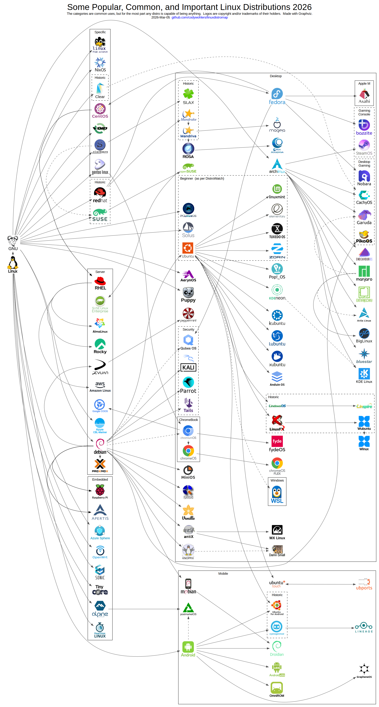

# Map of Linux Distributions

The [SVG version](linuxdistros.dot.svg) has each logo linked to its [DistroWatch](https://distrowatch.com) page (or Wikipedia).

These are all the distros I know, plus a few I didn't but kept hearing about.  Also included are the important historical ones and the top 25 from DistroWatch.  There are also "mobile distros" and some embedded ones.  Made with Graphviz.

### Some Notes:
- I have the categories as the most common use.  Some were hard to choose.
- **Beginner Desktop** category is [according to DistroWatch](https://distrowatch.com/search.php?category=Beginners).
- `Debian` is also commonly used as a **Desktop**.
- `Ubuntu` and several other **Desktop** distros are also commonly used as **Servers** and other types.
- `Bazzite` is also commonly used for **Desktop Gaming**.
- `CachyOS`, `Nobara`, and `PikaOS` also have **Handheld Gaming Console** editions.
- `CachyOS` kernel optimizations are inspired by `Clear Linux`.
- `SteamOS` used to be based on `Debian` (not shown).
- `CentOS` is now upstream of `RHEL` and is called `CentOS Stream`.
- `QubesOS` comes with `Fedora` or `Debian` based containers but runs a `Fedora` based hypervisor host.
- `ChromiumOS` is based on `Gentoo` but can install a `Debian` subsystem.
- `PostmarketOS` still uses some `Android` kernel drivers.
- `KDE Linux` is the spiritual successor of `KDE Neon` but is based on `Arch`.

### To update/modify:
(requires Graphviz)
- edit `linuxdistros.dot`
- for **`png`** run `dot -Tpng -O linuxdistros.dot`
- for **`svg`** run `dot -Tsvg -O linuxdistros.dot`

2026 codywohlers
